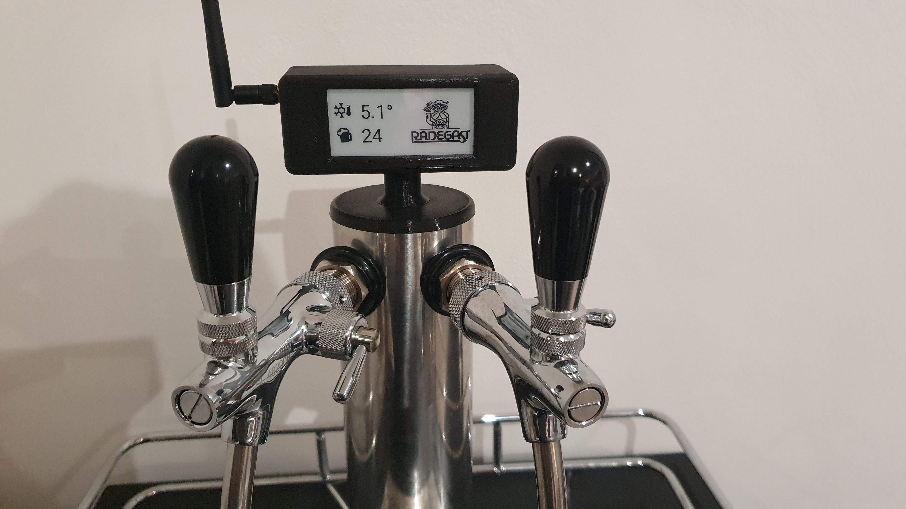
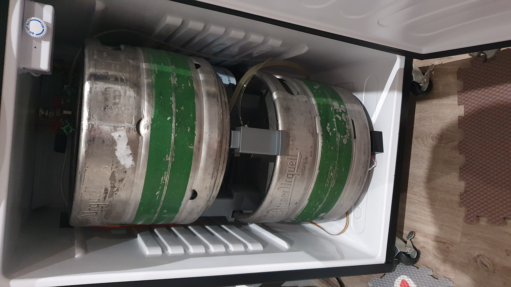
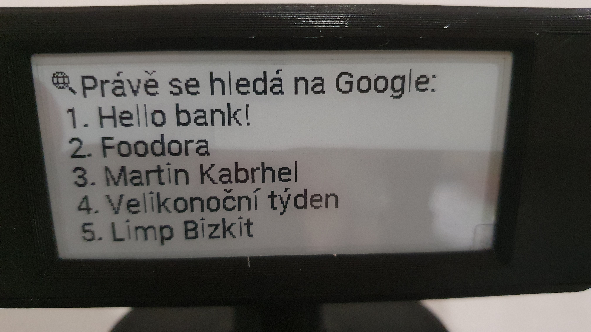
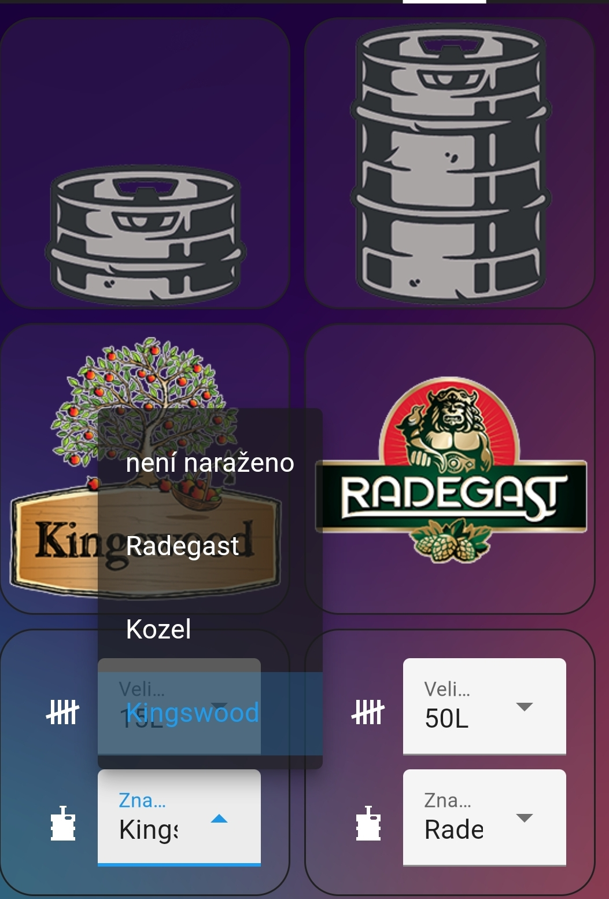
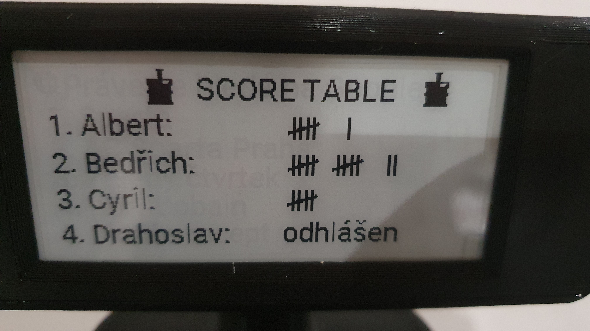
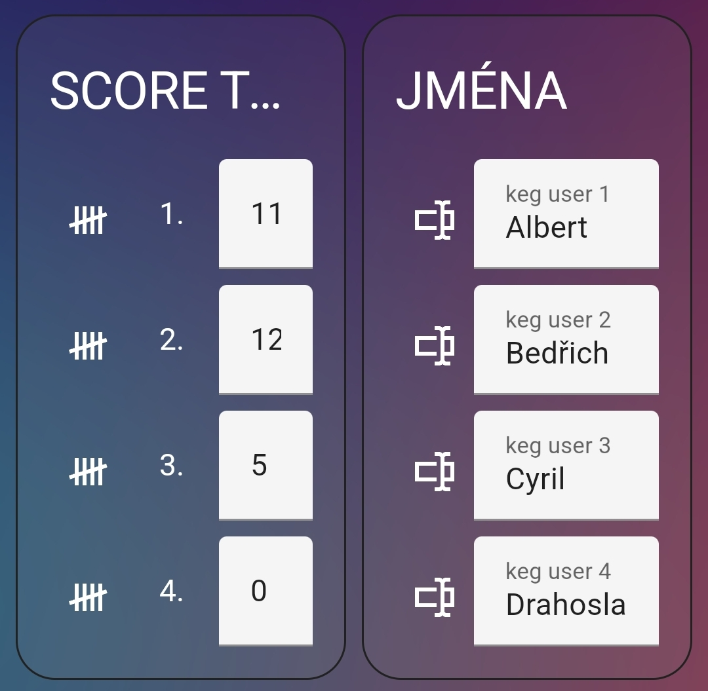
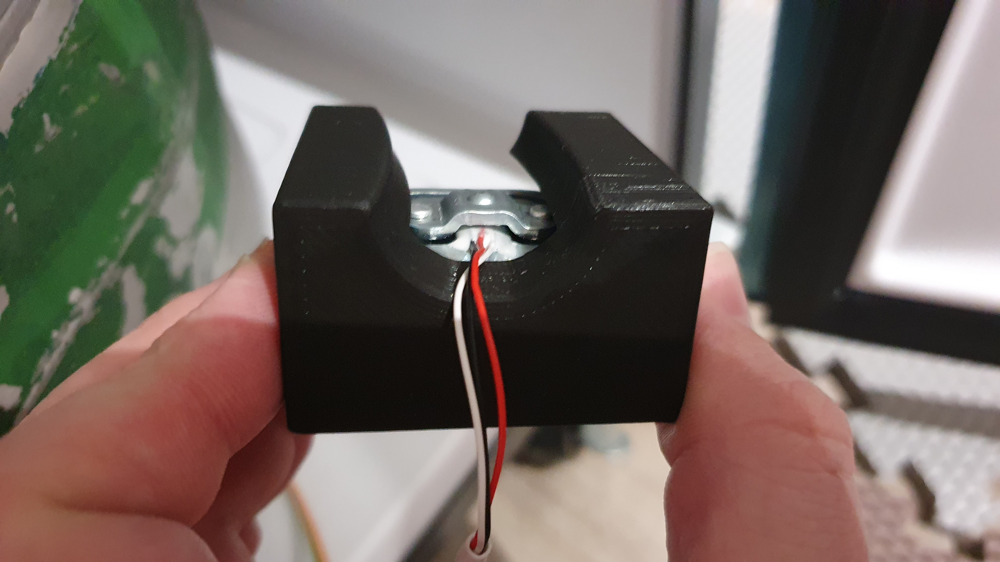

# keg_load_cell_esphome
<h1 align="center">
  ESPHome KEG scale - E-PAPER
</h1>

KEG Fridge, loadcell, epaper, hx711, Google Trends

## Hardware
* ESP32
* 2in9 epaper Waveshare display
* HX711 ADC converter
* 50KG loadcell

## Google Trends
* zobrazení aktuálních trendu vyhledávání na Google.com
* komponenta pro vypsání RSS jako sensor - https://github.com/custom-components/feedparser

## Lovelace setting
* nastavení offsetu pro váhu sudu (15,30,50L)
* výběr loga pivovaru k zobrazení na epaper

## Score table
* to není třeba vysvětlovat :)
* == stiskem tlačítka se přičte do konkrétního input_number hodnota a podle ní se zobrazí "čárka" na displayi ==

* input_text pro jména na Score Table

## Tenzometry a držáky

